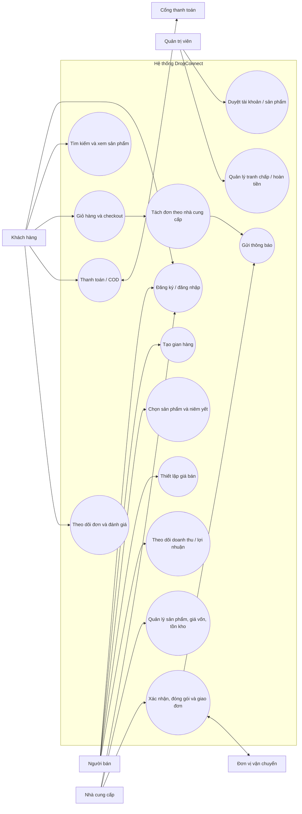

# 1. Actor và Use Case

## 1.1 Actor và trách nhiệm

| Actor | Mục tiêu chính | Giới hạn quyền |
|---|---|---|
| Khách hàng | Tìm, mua, theo dõi, đánh giá | Chỉ xem dữ liệu đơn và đánh giá của chính mình |
| Người bán | Mở gian hàng, niêm yết hàng, định giá, chăm sóc đơn | Không được sửa giá vốn/tồn kho của Nhà cung cấp |
| Nhà cung cấp | Quản lý catalog, tồn kho, nhận và thực hiện đơn | Chỉ xem đơn thực hiện thuộc chính mình |
| Quản trị viên | Duyệt, kiểm duyệt, giải quyết tranh chấp, cấu hình | Có quyền quản trị/audit theo chính sách |
| Cổng thanh toán | Nhận yêu cầu và callback kết quả thanh toán | Hệ thống ngoài, không có quyền UI |
| Đơn vị vận chuyển | Nhận yêu cầu giao hàng, trả tracking/trạng thái | Hệ thống ngoài, có thể mô phỏng trong MVP |

## 1.2 Use case diagram

## 1.3 Ma trận phân quyền MVP

| Chức năng | Khách | Người bán | Nhà cung cấp | Admin |
|---|:---:|:---:|:---:|:---:|
| Xem catalog công khai | ✓ | ✓ | ✓ | ✓ |
| Tạo/sửa sản phẩm nguồn |  |  | ✓ | ✓ |
| Cập nhật giá vốn, tồn kho |  |  | ✓ | ✓ |
| Tạo niêm yết và giá bán |  | ✓ |  | ✓ |
| Checkout / thanh toán | ✓ |  |  | ✓ hỗ trợ |
| Xem đơn mua | Chỉ của mình | Đơn liên quan shop |  | ✓ |
| Xem đơn thực hiện |  | Đơn liên quan shop | Chỉ của mình | ✓ |
| Cập nhật giao hàng |  |  | ✓ | ✓ |
| Duyệt seller/supplier/product |  |  |  | ✓ |
| Xử lý hoàn tiền/tranh chấp | Tạo yêu cầu | Phản hồi | Phản hồi | Quyết định |
