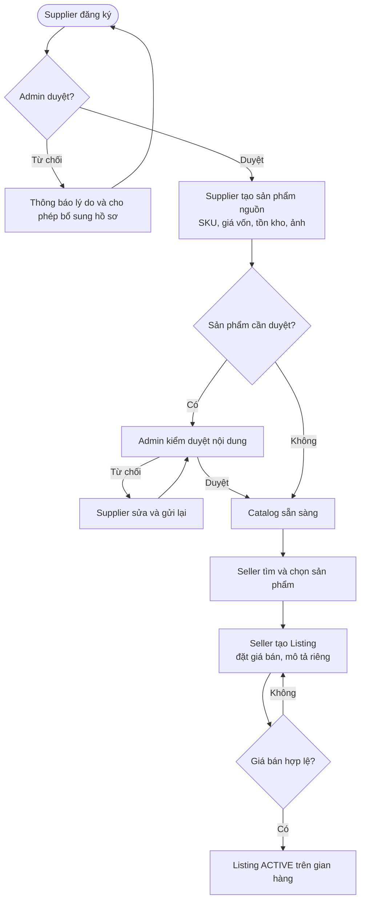
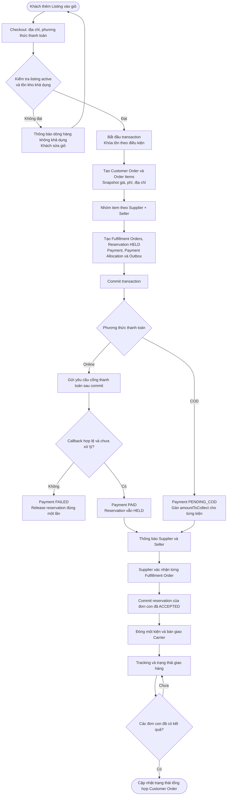
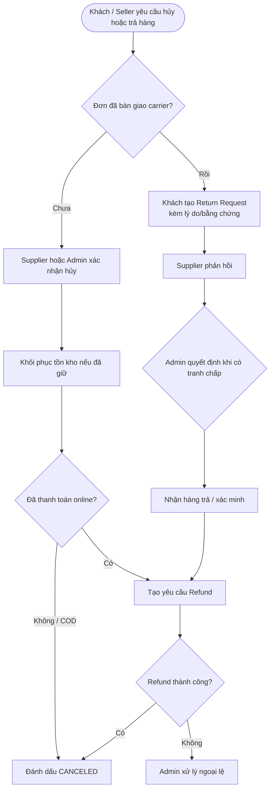
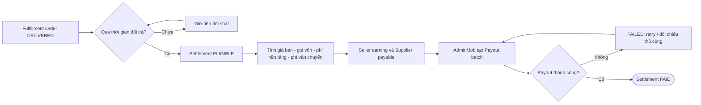

# 2. Workflow nghiệp vụ

## WF-01 — Onboarding và niêm yết sản phẩm

**Rule chính:** người bán chỉ tạo `Listing` tham chiếu `Product`; không sao chép quyền sửa `costPrice`, tồn kho hoặc SKU nguồn.

## WF-02 — Checkout, tách đơn và giao hàng

<!-- diagram-id: eaf0c9b1-e551-46e3-bc03-c2d4f8b7d6c5 -->

## WF-03 — Hủy, trả hàng và hoàn tiền

## WF-04 — Đối soát lợi nhuận và chi trả

