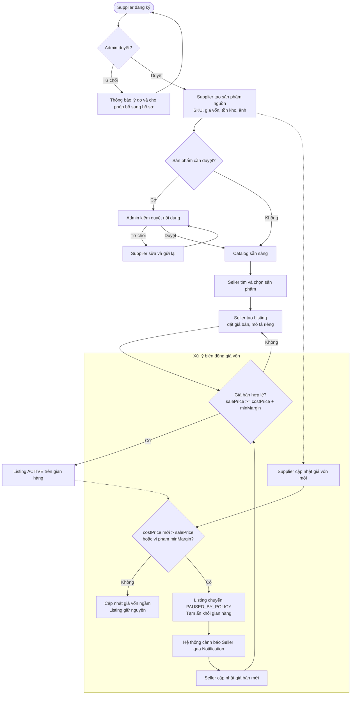
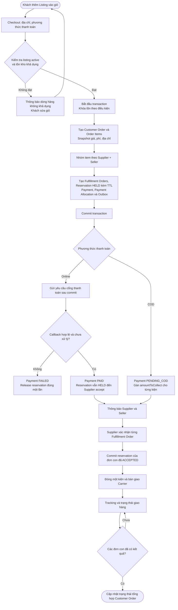
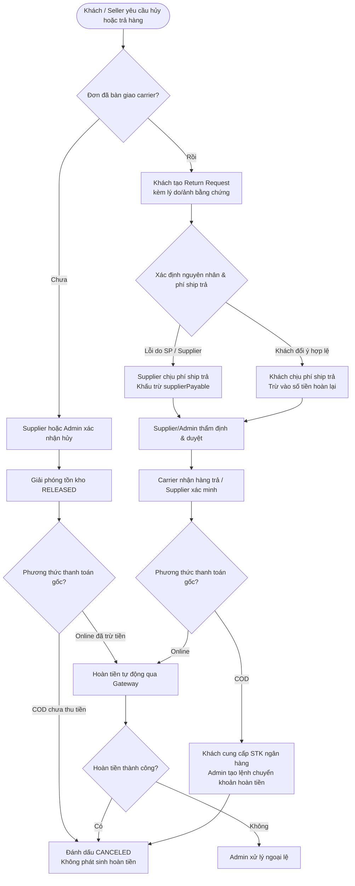
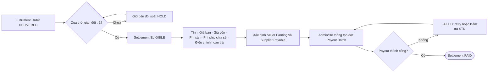

# 2. Workflow nghiệp vụ

## WF-01 — Onboarding và niêm yết sản phẩm

**Quy tắc nghiệp vụ chính:**
- Người bán chỉ tạo `Listing` tham chiếu `Product`; không có quyền sửa `costPrice`, tồn kho hoặc SKU nguồn.
- **Xử lý biến động giá vốn:** Khi Supplier tăng giá vốn `costPrice` khiến `salePrice < costPrice + minMargin`, hệ thống tự động chuyển trạng thái Listing sang `PAUSED_BY_POLICY` và tạm ẩn trên gian hàng để bảo vệ Seller không bị lỗ. Seller nhận thông báo và phải cập nhật lại giá bán mới hợp lệ để kích hoạt lại Listing.

---

## WF-02 — Checkout, giữ tồn kho, tách đơn và giao hàng

<!-- diagram-id: eaf0c9b1-e551-46e3-bc03-c2d4f8b7d6c5 -->

**Quy tắc nghiệp vụ chính:**
- **Thời điểm giữ tồn kho (Reservation):** Ngay khi qua bước kiểm tra giỏ hàng hợp lệ, hệ thống tạo bản ghi `StockReservation` ở trạng thái `HELD` kèm thời hạn (TTL 15 phút với Online, 24 giờ với COD). Việc này chặn đứng nguy cơ bán vượt tồn kho (Overselling) trong lúc khách đang thao tác thanh toán.
- **Commit và Release tồn:** Nếu thanh toán thất bại/quá hạn TTL, tồn kho được giải phóng (`RELEASED`) ngay lập tức. Tồn kho thực chỉ bị trừ vĩnh viễn (`COMMITTED`) khi Supplier bấm chấp nhận đơn (`ACCEPTED`).

---

## WF-03 — Hủy, trả hàng và hoàn tiền

**Quy tắc nghiệp vụ chính:**
- **Hoàn tiền cho đơn COD:** Do tiền COD khách thanh toán bằng tiền mặt cho shipper và được Carrier nộp về Nền tảng, khi có yêu cầu hoàn tiền COD hợp lệ, hệ thống yêu cầu Khách hàng cung cấp thông tin tài khoản ngân hàng để Admin/kế toán thực hiện lệnh chuyển khoản hoàn tiền trực tiếp (`Bank Transfer Refund`).
- **Phân định phí vận chuyển chiều trả hàng:**
  - *Lỗi sản phẩm / Nhà cung cấp (giao sai mẫu, hỏng hóc, sai mô tả):* Supplier chịu 100% chi phí vận chuyển chiều trả hàng (trừ trực tiếp vào đối soát `supplierPayable`).
  - *Lỗi chủ quan từ Khách hàng (đổi ý trong thời hạn cho phép):* Khách hàng tự chịu phí ship trả lại cho kho Supplier (khấu trừ vào số tiền hoàn nhận về).

---

## WF-04 — Đối soát lợi nhuận và chi trả

