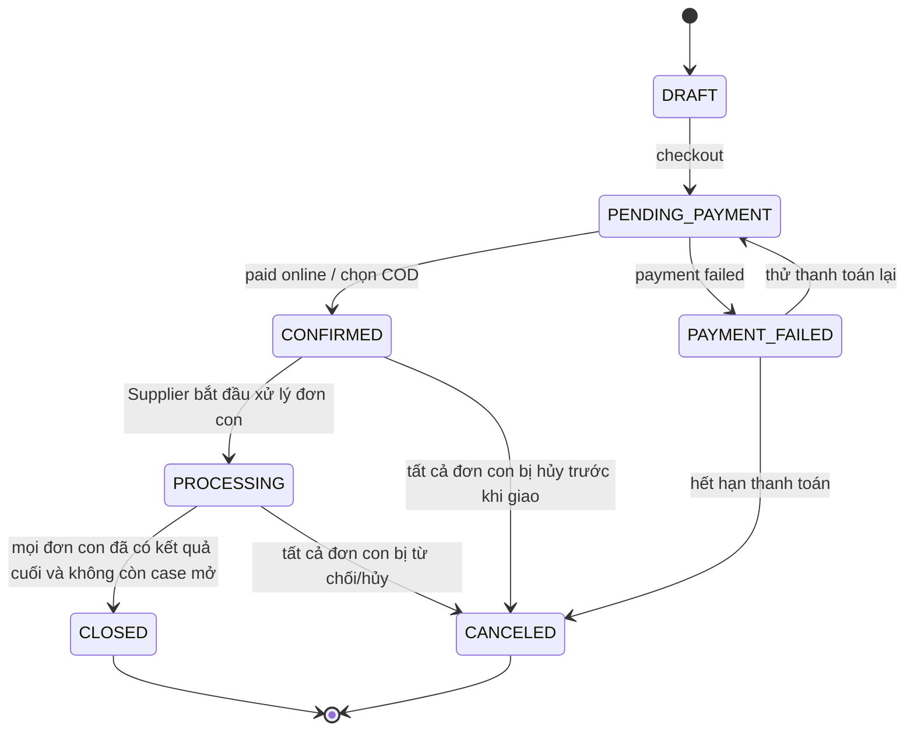
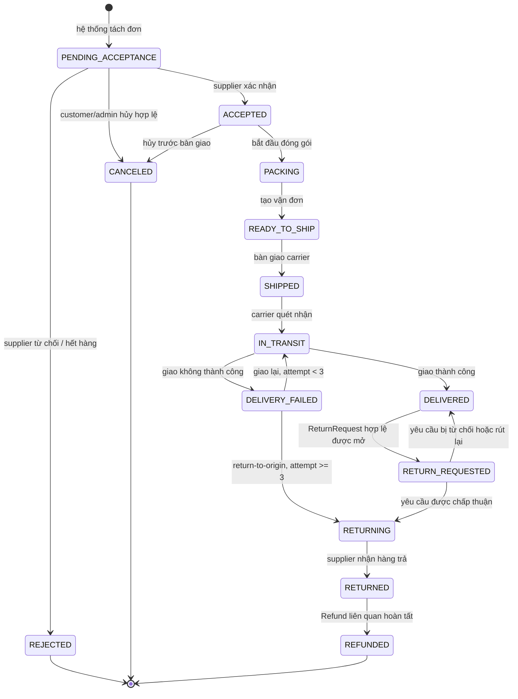
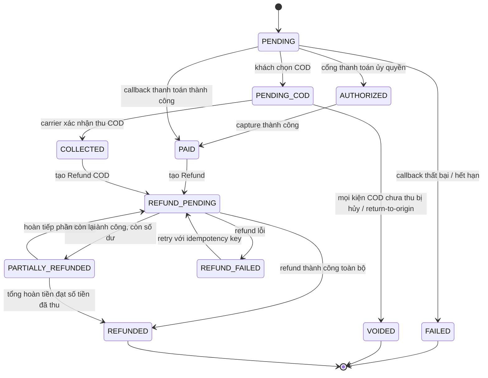
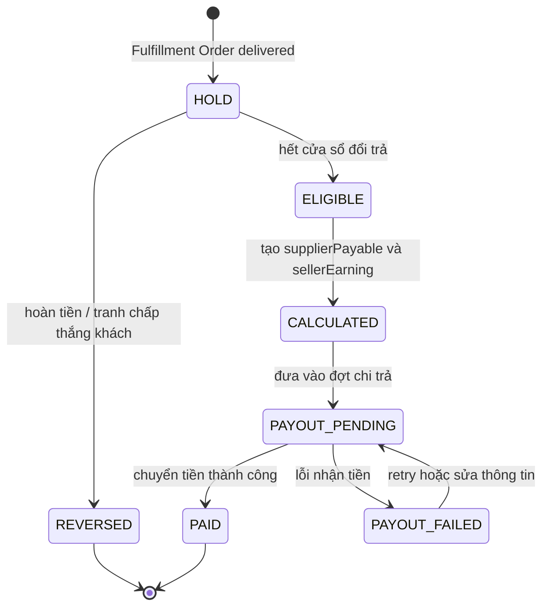
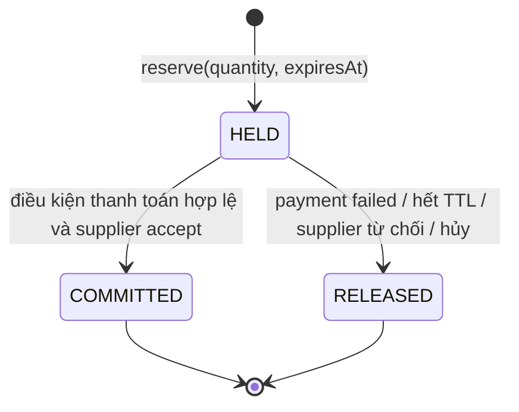
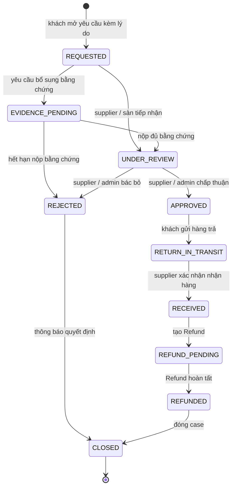

# 3. State machine

## 3.1 Customer Order và trạng thái tổng hợp

`CustomerOrder.status` chỉ quản lý vòng đời checkout. Tiến trình giao hàng hiển thị cho khách là `fulfillmentSummary`, được tính lại từ các `FulfillmentOrder`; đơn con vẫn là nguồn sự thật cho tồn kho, giao hàng, đổi trả và đối soát. Yêu cầu trả hàng và hoàn tiền không làm ghi đè tùy tiện trạng thái của đơn cha.

### Quy tắc tổng hợp trạng thái đơn cha

`fulfillmentSummary` là projection, không phải workflow để ghi đè `FulfillmentOrder`.

| Điều kiện trên Fulfillment Order / Return Request | `fulfillmentSummary` |
|---|---|
| Tất cả bị `REJECTED` hoặc `CANCELED` | `CANCELED` |
| Có đơn bị từ chối/hủy và còn đơn chưa có kết quả cuối | `PARTIALLY_CANCELED` |
| Có ít nhất một đơn `DELIVERED`, còn đơn khác đang xử lý | `PARTIALLY_FULFILLED` |
| Có đơn đã giao và có đơn bị hủy hoặc hoàn tiền | `PARTIALLY_COMPLETED` |
| Tất cả đơn giao thành công, còn trong cửa sổ đổi trả | `FULFILLED` |
| Có yêu cầu trả hàng/khiếu nại chưa đóng | `RETURN_IN_PROGRESS` |
| Mọi đơn con đã đóng và hết cửa sổ đổi trả | `COMPLETED` |

`Payment` hiển thị độc lập `PAID`, `PARTIALLY_REFUNDED` hoặc `REFUNDED`; không suy ra các giá trị này chỉ từ `fulfillmentSummary`.

---

## 3.2 Fulfillment Order

Mỗi `FulfillmentOrder` đại diện cho một kiện/mã vận đơn trong MVP theo cặp Supplier – Seller. `deliveryAttemptCount` được lưu và kiểm tra ở server; giao lại chỉ được phép khi số lần giao nhỏ hơn 3.

`RETURNING` do giao thất bại là return-to-origin; với COD chưa thu tiền, Payment/Allocation liên quan được `VOIDED`, còn Online đã thu tiền tạo `Refund` theo số tiền đã phân bổ.

---

## 3.3 Payment và Refund

`Payment` theo dõi khoản phải thu; mỗi lần trả tiền lại là một `Refund` riêng có `amount`, `status`, `providerRefundId` và idempotency key. Tổng `Refund.amount` không được vượt số tiền đã thu của Payment/Allocation.

---

## 3.4 Settlement (đối soát)

---

## 3.5 Stock Reservation (giữ tồn kho)

`StockReservation` là bản ghi theo `OrderItem`, được tạo trực tiếp ở `HELD`; `AVAILABLE` là thuộc tính của Inventory, không phải trạng thái của reservation. Hàng trả về tạo một `InventoryAdjustment` mới, không tái sử dụng reservation đã `COMMITTED`.

**Quy tắc:** TTL mặc định MVP là 15 phút với Online chưa thanh toán và 24 giờ với COD chưa được Supplier xác nhận; đây là cấu hình server-side. Commit/release phải nguyên tử và idempotent.

---

## 3.6 Return Request & Dispute

`ReturnRequest` là nguồn sự thật cho đổi trả/khiếu nại, thuộc một `FulfillmentOrder` hoặc `OrderItem`. Cửa sổ đổi trả là `returnWindowDays` cấu hình được; MVP có thể đặt mặc định 7 ngày.

Không mở lại case cùng `reasonCode` sau khi đã `CLOSED`; mọi transition lưu actor, thời điểm, lý do và nguồn event.