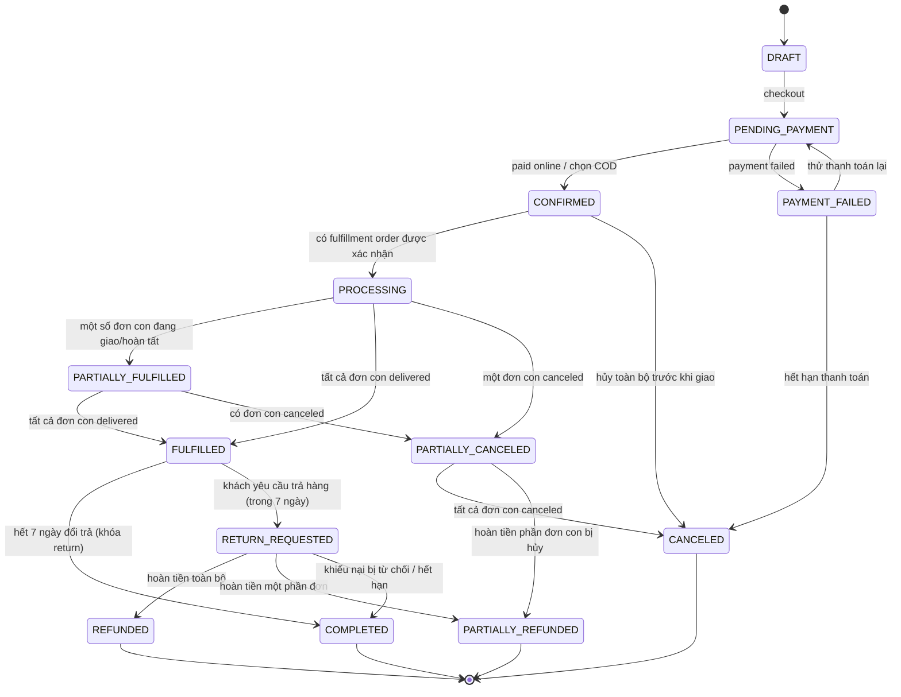
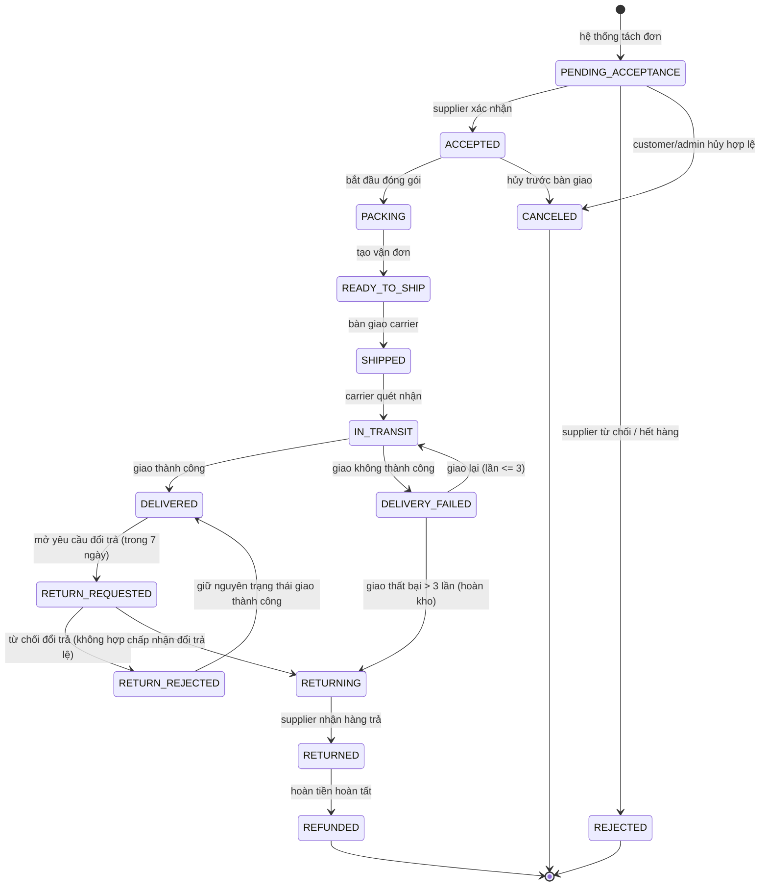
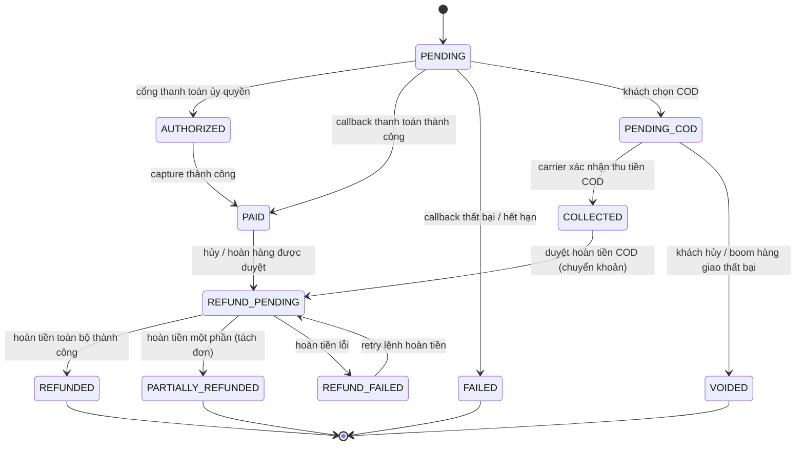
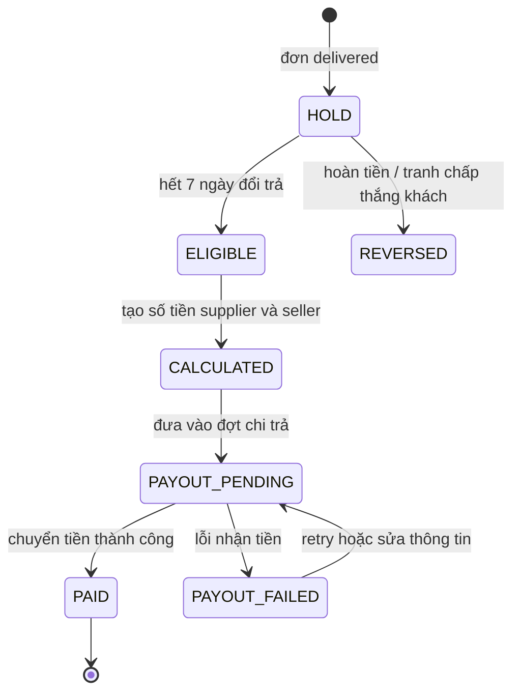
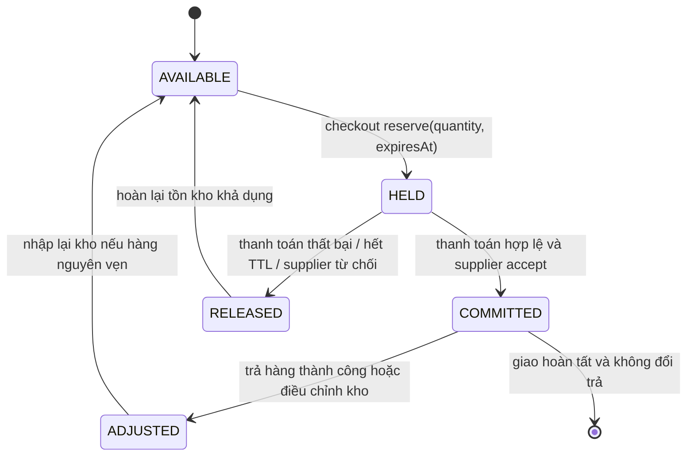
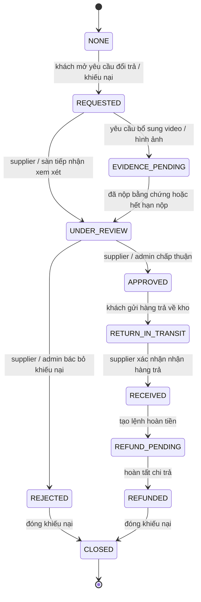

# 3. State machine

## 3.1 Customer Order

`Customer Order` là trạng thái tổng hợp ở góc nhìn khách hàng. Nó chỉ `COMPLETED` khi mọi `Fulfillment Order` hoàn tất và hết thời hạn khiếu nại (7 ngày); `PARTIALLY_*` khi các đơn con có kết quả khác nhau. Khi đã chuyển sang `COMPLETED`, hệ thống **khóa chặt không cho phép mở yêu cầu trả hàng (`RETURN_REQUESTED`)**.

---

## 3.2 Fulfillment Order

Quản lý chu trình thực hiện của từng kiện hàng theo cặp Supplier – Seller. Có cơ chế giới hạn giao lại tối đa 3 lần và nhánh từ chối trả hàng (`RETURN_REJECTED`).

---

## 3.3 Payment

Quản lý vòng đời thanh toán trực tuyến và COD. Bổ sung trạng thái `VOIDED` khi đơn COD bị hủy/boom hàng và `PARTIALLY_REFUNDED` khi hoàn tiền theo từng đơn con.

---

## 3.4 Settlement (đối soát)

---

## 3.5 Stock Reservation (giữ tồn kho)

Quản lý vòng đời giữ tồn kho tạm thời, ngăn chặn triệt để tình trạng bán vượt tồn kho (Overselling) khi nhiều khách mua cùng thời điểm.

**Quy tắc:**
- `HELD`: Tồn kho được khóa tạm thời ngay khi tạo đơn; có hạn TTL (15 phút với Online, 24 giờ với COD).
- `COMMITTED`: Trừ vĩnh viễn tồn kho khả dụng khi Supplier xác nhận đơn.
- `RELEASED`: Mở khóa trả lại số lượng cho kho khi đơn bị hủy hoặc quá thời hạn thanh toán.

---

## 3.6 Dispute & Return (khiếu nại và đổi trả)

Vòng đời giải quyết khiếu nại giữa Khách hàng, Nhà cung cấp và sự phân xử của Quản trị viên.

**Quy tắc:**
- Khách hàng chỉ có thể kích hoạt `REQUESTED` khi đơn hàng ở trạng thái `DELIVERED` và chưa quá thời hạn 7 ngày.
- Nếu bị `REJECTED`, đơn hàng quay về trạng thái hoàn tất bình thường và không được mở lại khiếu nại cho cùng lý do.
