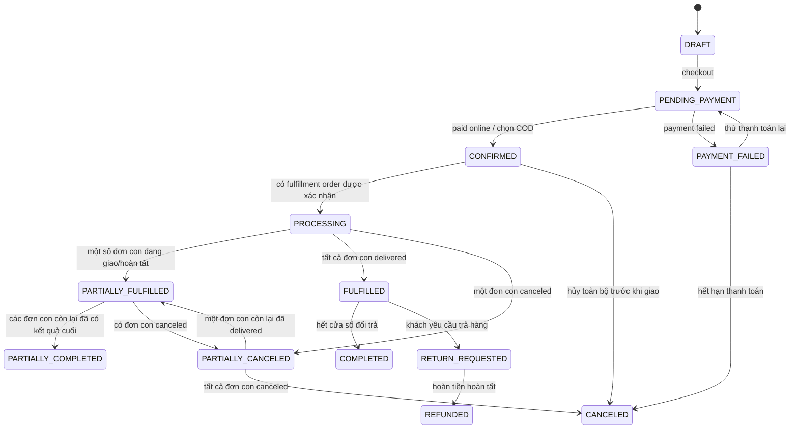
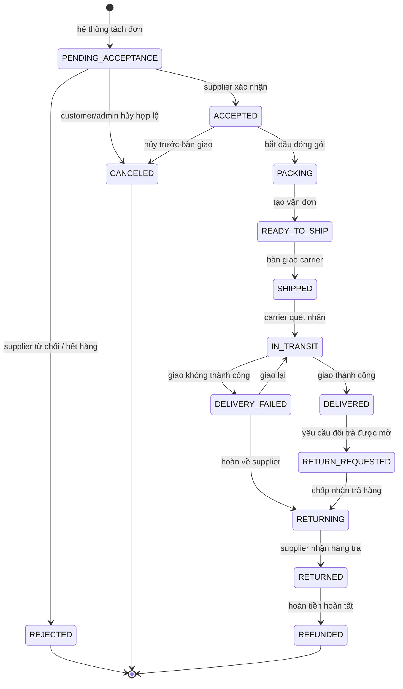
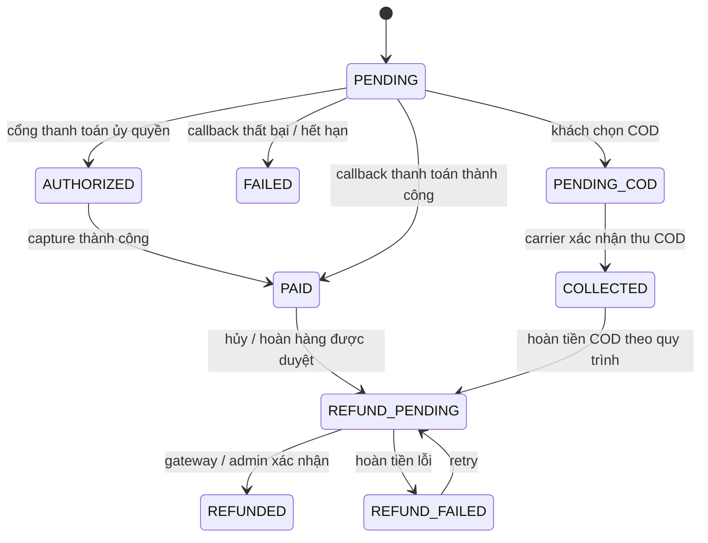
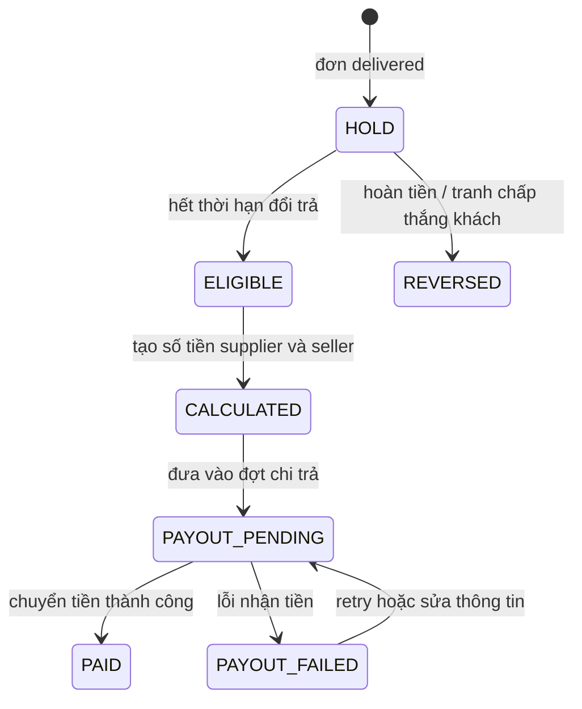

# 3. State machine

## 3.1 Customer Order

`Customer Order` chỉ giữ trạng thái đặt hàng/thanh toán ban đầu; tiến trình giao hàng hiển thị cho khách là `fulfillmentSummary` được tính từ các `Fulfillment Order`. Đơn con luôn là nguồn sự thật để kiểm tra quyền, tồn kho, giao hàng, đổi trả và đối soát.

### Quy tắc tổng hợp trạng thái đơn cha

`fulfillmentSummary` là projection được tính lại sau mỗi transition của đơn con, không phải workflow để ghi đè đơn con. Các quy tắc ưu tiên là:

| Điều kiện trên các Fulfillment Order | `fulfillmentSummary` |
|---|---|
| Tất cả bị `REJECTED` hoặc `CANCELED` | `CANCELED` |
| Có đơn bị từ chối/hủy và còn đơn chưa có kết quả cuối | `PARTIALLY_CANCELED` |
| Có ít nhất một đơn `DELIVERED`, còn đơn khác đang xử lý | `PARTIALLY_FULFILLED` |
| Có đơn đã giao và có đơn bị hủy/hoàn tiền | `PARTIALLY_COMPLETED` |
| Tất cả đơn giao thành công và chưa hết cửa sổ đổi trả | `FULFILLED` |
| Tất cả đơn giao thành công, hết cửa sổ đổi trả và không có hoàn tiền | `COMPLETED` |

## 3.2 Fulfillment Order

## 3.3 Payment

## 3.4 Settlement (đối soát)

