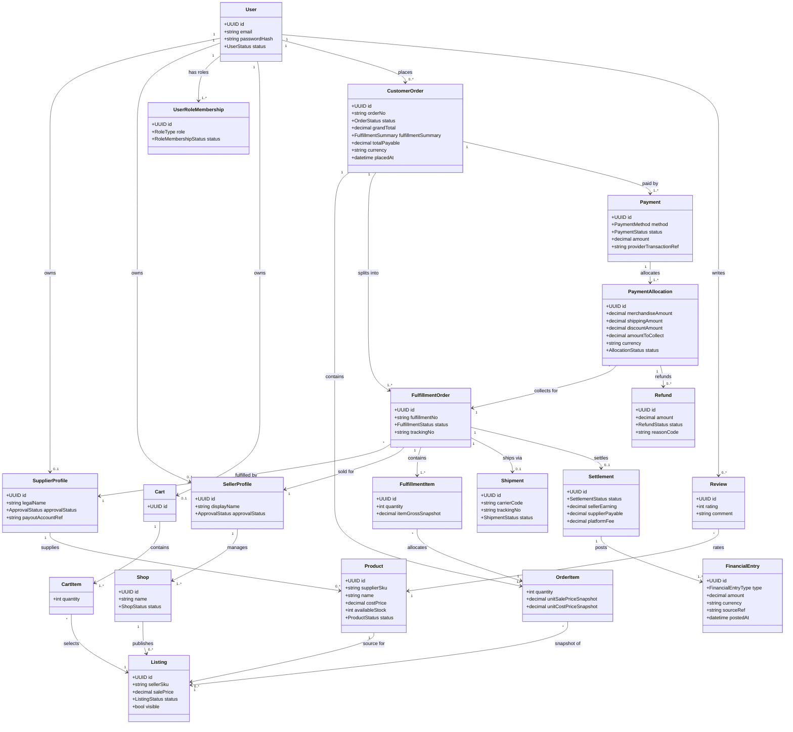

# 4. UML Class Diagram — miền nghiệp vụ

## Invariant quan trọng

1. `Listing.salePrice >= Product.costPrice + minMargin` theo chính sách nền tảng.
2. Một `OrderItem` lưu snapshot `unitSalePriceSnapshot` và `unitCostPriceSnapshot` khi checkout thành công.
3. Mỗi `FulfillmentOrder` chỉ thuộc một `SupplierProfile` và một `SellerProfile`.
4. Chỉ `Listing.ACTIVE` của `Product.ACTIVE` mới được thêm vào giỏ.
5. Thay đổi trạng thái fulfillment phải được audit kèm actor, thời điểm và lý do.

6. Role là quan hệ nhiều-nhiều qua `UserRoleMembership`; JWT/request phải chọn active role/profile, không suy ra quyền từ một cột role đơn.
7. Một `FulfillmentItem` phân bổ một `OrderItem` cho đúng một Fulfillment Order; tổng quantity được phân bổ không vượt quantity snapshot của OrderItem.
8. Mỗi PaymentAllocation thuộc đúng một Fulfillment Order; tổng allocation hiệu lực bằng số tiền Customer phải trả. Refund và FinancialEntry chỉ append, phải tham chiếu allocation/source event.
9. Một Fulfillment Order có tối đa một Shipment ở MVP. COD/Settlement của đơn con chỉ hợp lệ khi allocation tương ứng đã được thu hoặc funded.
