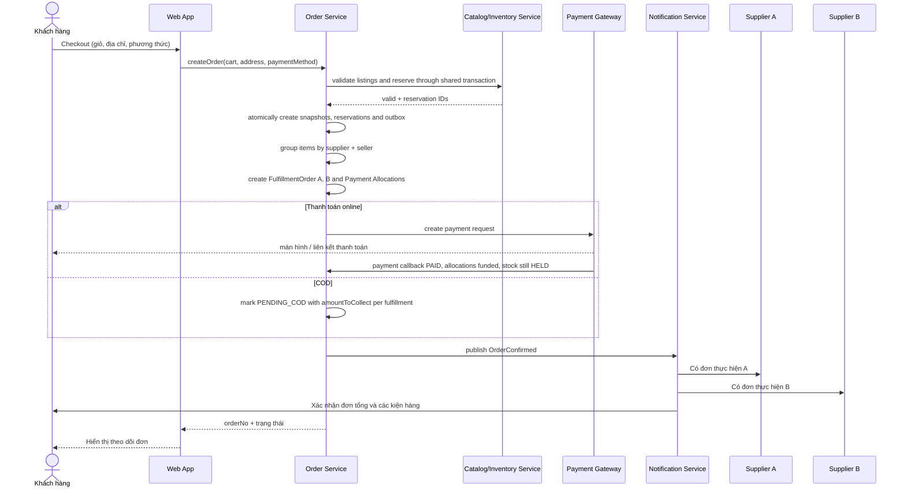
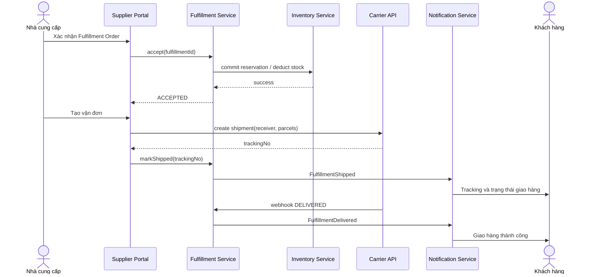
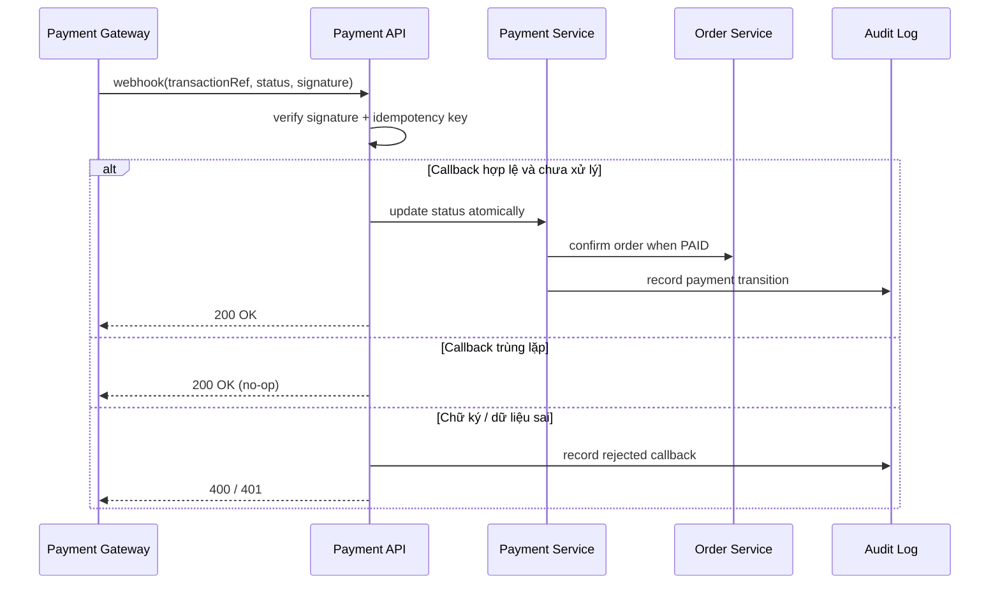

# 5. Sequence Diagram

## SD-01 — Khách checkout một giỏ nhiều nhà cung cấp

```mermaid
sequenceDiagram
  actor C as Khách hàng
  participant Web as Web App
  participant Order as Order Service
  participant Catalog as Catalog/Inventory Service
  participant Pay as Payment Gateway
  participant Notify as Notification Service
  participant S1 as Supplier A
  participant S2 as Supplier B

  C->>Web: Checkout (giỏ, địa chỉ, phương thức)
  Web->>Order: createOrder(cart, address, paymentMethod)
  Order->>Catalog: validate listings and reserve through shared transaction
  Catalog-->>Order: valid + reservation IDs
  Order->>Order: atomically create snapshots, reservations and outbox
  Order->>Order: group items by supplier + seller
  Order->>Order: create FulfillmentOrder A, B and Payment Allocations
  alt Thanh toán online
    Order->>Pay: create payment request
    Pay-->>C: màn hình / liên kết thanh toán
    Pay->>Order: payment callback PAID, allocations funded, stock still HELD
  else COD
    Order->>Order: mark PENDING_COD with amountToCollect per fulfillment
  end
  Order->>Notify: publish OrderConfirmed
  Notify->>S1: Có đơn thực hiện A
  Notify->>S2: Có đơn thực hiện B
  Notify->>C: Xác nhận đơn tổng và các kiện hàng
  Order-->>Web: orderNo + trạng thái
  Web-->>C: Hiển thị theo dõi đơn
```

## SD-02 — Nhà cung cấp thực hiện một đơn

```mermaid
sequenceDiagram
  actor S as Nhà cung cấp
  participant Portal as Supplier Portal
  participant Fulfill as Fulfillment Service
  participant Inventory as Inventory Service
  participant Carrier as Carrier API
  participant Notify as Notification Service
  actor C as Khách hàng

  S->>Portal: Xác nhận Fulfillment Order
  Portal->>Fulfill: accept(fulfillmentId)
  Fulfill->>Inventory: commit reservation / deduct stock
  Inventory-->>Fulfill: success
  Fulfill-->>Portal: ACCEPTED
  S->>Portal: Tạo vận đơn
  Portal->>Carrier: create shipment(receiver, parcels)
  Carrier-->>Portal: trackingNo
  Portal->>Fulfill: markShipped(trackingNo)
  Fulfill->>Notify: FulfillmentShipped
  Notify->>C: Tracking và trạng thái giao hàng
  Carrier->>Fulfill: webhook DELIVERED
  Fulfill->>Notify: FulfillmentDelivered
  Notify->>C: Giao hàng thành công
```

## SD-03 — Callback thanh toán an toàn

```mermaid
sequenceDiagram
  participant Gateway as Payment Gateway
  participant API as Payment API
  participant Payment as Payment Service
  participant Order as Order Service
  participant Log as Audit Log

  Gateway->>API: webhook(transactionRef, status, signature)
  API->>API: verify signature + idempotency key
  alt Callback hợp lệ và chưa xử lý
    API->>Payment: update status atomically
    Payment->>Order: confirm order when PAID
    Payment->>Log: record payment transition
    API-->>Gateway: 200 OK
  else Callback trùng lặp
    API-->>Gateway: 200 OK (no-op)
  else Chữ ký / dữ liệu sai
    API->>Log: record rejected callback
    API-->>Gateway: 400 / 401
  end
```
