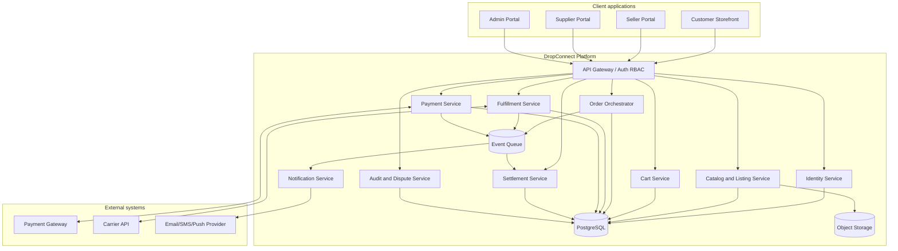
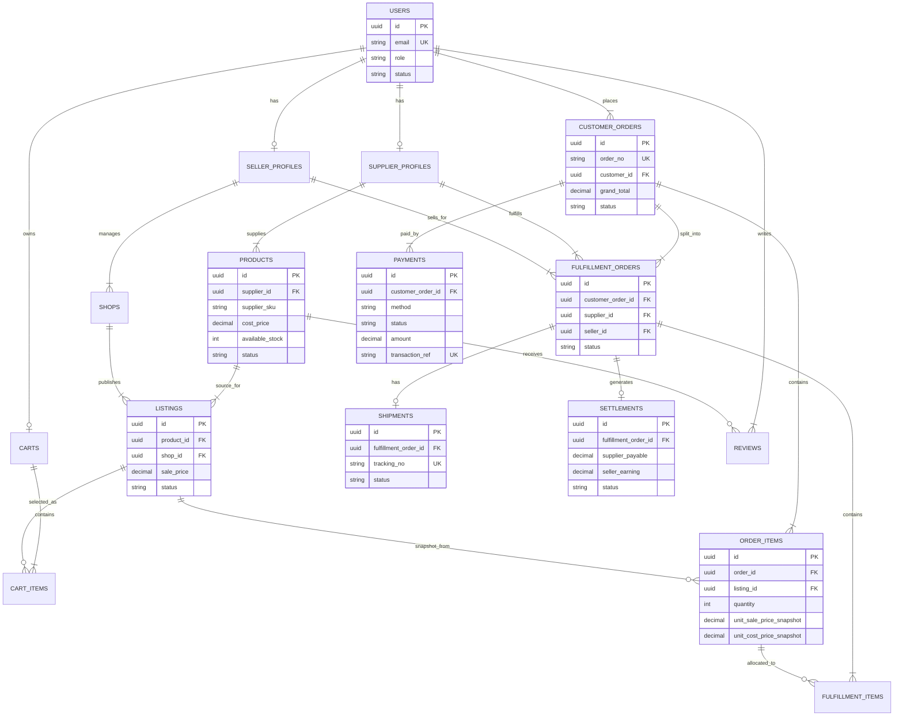

# 6. Component architecture và ERD

## 6.1 Component diagram

## 6.2 ERD dữ liệu cốt lõi

## 6.3 Event chính

| Event | Producer | Consumer | Mục đích |
|---|---|---|---|
| `OrderConfirmed` | Order Service | Notification, Fulfillment | Báo supplier/seller và khởi tạo xử lý đơn |
| `PaymentSucceeded` | Payment Service | Order, Audit | Xác nhận đơn online, ghi audit |
| `FulfillmentShipped` | Fulfillment Service | Notification, Order | Đồng bộ tracking và trạng thái tổng |
| `FulfillmentDelivered` | Fulfillment/Carrier webhook | Order, Settlement, Notification | Đánh dấu giao thành công, bắt đầu hold đối soát |
| `RefundCompleted` | Payment Service | Order, Settlement, Notification | Cập nhật hoàn tiền và đảo đối soát nếu cần |
| `SettlementEligible` | Settlement Service | Payout job | Đưa đơn vào đợt chi trả |
